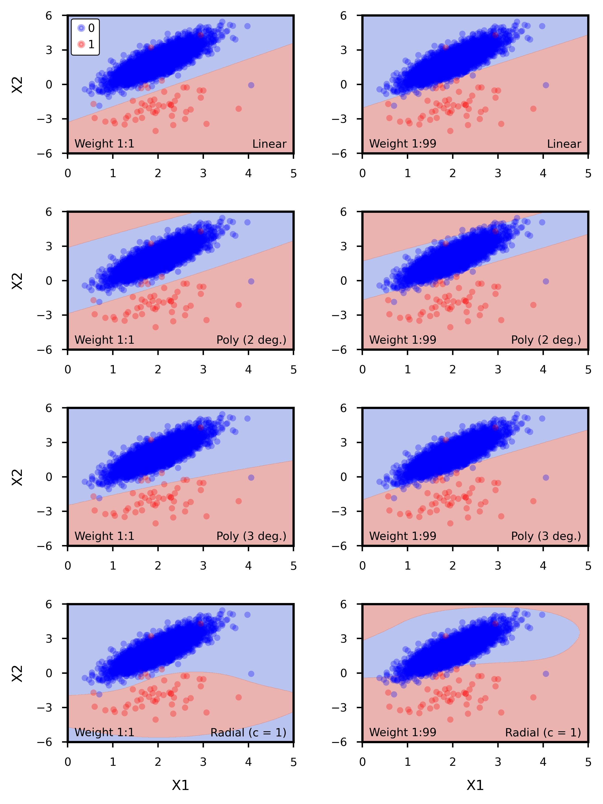

```{r setup, include = FALSE}

knitr::opts_chunk$set(echo = TRUE, eval = FALSE)
library(reticulate)

```

# Introduction

Imbalanced data can prove to be quite challenging to work with when using conventional machine learning algorithms, as many of these algorithms operate under the assumption that all classes in the data are approximately balanced. However, in many cases, the data we are most interested in classifying are often a minority of observations in the entire set; for example, a few spam emails out of hundreds of legitimate messages, or a few fraudulent credit card transactions out of thousands of legitimate purchases. Because traditional measurements of model performance often focus on metrics such as classification accuracy, they often fail to adequately capture the minority class, and we may observe instances when a model on a dataset with 990 observations in class A and 10 observations in class B can achieve 99% accuracy by completely ignoring class A and classifying everything as B. Also, the costs of misclassification might vary between the classes; for example, while fraudulent credit card transactions are extremely rare compared to legitimate purchases, a fraudulent transaction that is not detected may cost a bank or credit card company significantly more than a legitimate transaction that is falsely flagged as fraudulent. Many algorithms by default will assume equal costs of misclassification, which may not necessarily be true for certain scenarios.

Here, we use synthetic data to explore some of the tools available in Python for classifying imbalanced data, heavily relying on `sklearn` for most of model and scoring functions but also utilising some of the various sampling functions from `imbalanced-learn`. Some of the topics we explore include scoring metrics such as area under the precision-recall curve (AUPRC), cost-sensitive learning using class weights, and various techniques to rebalance data such as SMOTE and ADASYN. We also explore imbalanced classification in datasets with binary classes as well as in datasets with three or more different classes.

# Two-class Classification

## Data Generation
First, we set up a two-class classification problem. We randomly generate a total of 10000 samples, with the majority class making up 99% of the data and the minority class making up the other 1%. We can do this using the `make_classification` function from `sklearn`.

``` {python}

data_x, data_y = make_classification(n_samples = 10000, n_classes = 2, n_features = 2,
                                     n_informative = 2, n_redundant = 0, n_repeated = 0,
                                     weights = [0.99, 0.01], n_clusters_per_class = 1,
                                     flip_y = 0.006, random_state = 1, class_sep = 2)

```

As can be seen in Figure \ref{fig:Figure1}, we allow for a bit of overlap between the two classes so that we can explore the trade-offs involved in misclassifying points in the overlap zone; this becomes especially interesting once we assign different costs to the correct classification of each class.

```{r Figure1, eval = TRUE, echo = FALSE, out.width = "450px", out.height = "450px", fig.cap = "\\label{fig:Figure1} A 50/50 split of the data into training (left) and test (right) sets. The majority class outnumbers the minority class by a ratio of 99:1. \\bigskip"}

knitr::include_graphics("Plot_Pts.jpeg")

```

## Discriminant Analysis

First, we fit linear discriminant analysis (LDA) and quadratic discriminant analysis (QDA) models to our data. We start with a single validation set approach, splitting the data into a training set (50%) and test set (50%), done using the code below.

``` {python}

train_x, test_x, train_y, test_y = train_test_split(data_x, data_y, test_size = 0.5,
                                                    random_state = 2, stratify = data_y)

```

We can then fit the model to the training set before evaluating it on the test set. To fit the LDA and QDA models, we can use the `LinearDiscriminantAnalysis` and `QuadraticDiscriminantAnalysis` functions from `sklearn`, as is shown in the code below. For each model, we first create a model object using each its respective function and then use the `fit` method to fit the models to the training data.

``` {python}

clfLDA = LinearDiscriminantAnalysis()
clfLDA.fit(train_x, train_y)
clfQDA = QuadraticDiscriminantAnalysis()
clfQDA.fit(train_x, train_y)

```

For now, we assume that the cost of misclassifying a point from the majority class is the same as misclassifying a point from the minority class, so we do not place weights on either class. As such, we can compare performance on the training data using a micro-averaged F1-score, and find that the LDA model outperforms the QDA model at 0.9962 versus 0.9958. We can also compare performance using the area under the precision-recall curve (AUPRC) on the training data and find that LDA again outperforms QDA at 0.8429 versus 0.8207. As can be seen in Figure \ref{fig:Figure2}, these differences are likely due to the fact that the QDA model misclassifies several majority class data points near the decision boundary, while the LDA model does so to a lesser extent. At this point, it is clear that the linear model performs better than the quadratic model, so we choose the former over the latter and then evaluate its performance on the test data; upon doing so, we get a micro-averaged F1-score of 0.9976 and an AUPRC of 0.8994, indicating that the linear model actually performs better on the test data than it does on the training data.

It is important to note that the way the data is partitioned can affect model results, especially when using a single validation set; cross-validation provides an alternative approach that is more robust to randomness in how the training and test data are split, often allowing for more accurate model fitting and selection. We can write a function that performs cross-validation on a specified model and then returns the desired metrics, as has been done below.

``` {python}

def model_cv(obj, n_rep, metList, data_x = data_x, data_y = data_y):
    cv = RepeatedStratifiedKFold(n_splits = 2, n_repeats = n_rep, random_state = 32463)
    output = cross_validate(obj, data_x, data_y, cv = cv, scoring = metList, n_jobs = -1)
    df = DataFrame(columns = ["metric", "value"])
    for i in metList:
        newdat = DataFrame({"metric":[i], "value":[mean(output["test_" + i])]})
        df = df.append(newdat, ignore_index = True)
    print(df)

```

```{r Figure2, eval = TRUE, echo = FALSE, out.width = "450px", out.height = "450px", fig.cap = "\\label{fig:Figure2} Decision boundaries generated by fitting LDA (left) and QDA (right) models to the training data. \\bigskip"}

knitr::include_graphics("Plot_DA.jpeg")

```

Here, we supply the function with a model, the number of replicates, and a list of metrics that we would like to calculate. The function then performs a 50/50 split on the data, fits the model to the training data, then evaluates the supplied metrics on the test data. This is then done for the specified number of replicates, and then each metric is averaged over the results of all replicates.

We can use this function for LDA and QDA, getting the mean micro-averaged and weighted F1-scores over 1000 replicates of 2-fold cross validation.

``` {python}

model_cv(obj = clfLDA, n_rep = 1000, metList = ["f1_micro", "f1_weighted"])
model_cv(obj = clfQDA, n_rep = 1000, metList = ["f1_micro", "f1_weighted"])

```

We again find that LDA outperforms QDA, with a mean micro-averaged F1-score of 0.9969 versus 0.9965.

## Support Vector Machines: Cost-Insensitive

We can also use the `SVC` function to fit support vector machines to our data, using the resulting decision boundary to classify the observations. Similar to what we did with LDA and QDA, we first create model objects using SVC and then use the `fit` method to fit the models to the training data.

``` {python}

clfLin = svm.SVC(gamma = "auto", kernel = "linear")
clfLin.fit(train_x, train_y)
clf2dg = svm.SVC(gamma = "auto", kernel = "poly", degree = 2)
clf2dg.fit(train_x, train_y)
clf3dg = svm.SVC(gamma = "auto", kernel = "poly", degree = 3)
clf3dg.fit(train_x, train_y)
clfRbf = svm.SVC(gamma = "auto", kernel = "rbf")
clfRbf.fit(train_x, train_y)

```

Here, we fit four different kernels to the same training set we used earlier: a linear kernel, a 2nd-degree polynomial kernel, a 3nd-degree polynomial kernel, and a radial kernel (with default $c=1$). The results of doing so, which can be seen in the left-hand panels of Figure \ref{fig:Figure3}, show that much like LDA and QDA, the models can correctly classify almost all of the observations in majority class while only missing a few observations in the minority class.

After using the `model_cv` function we defined earlier to perform 1000 instances of 2-fold cross-validation, we find that the 2nd-degree polynomial model performs the best with a mean micro-averaged F1-score of 0.99678, and the 3rd-degree polynomial model performs the worst with a mean micro-averaged F1-score of 0.99661. Note that we still assume that the cost of misclassifying a point from the majority class is the same as misclassifying a point from the minority class, so the use of micro-averaged F1-score as a scoring metric is still appropriate.

```{r Figure3, eval = TRUE, echo = FALSE, out.width = "600px", out.height = "600px", fig.cap = "\\label{fig:Figure3} Decision boundaries generated by various SVM kernels to the training data, with no weight on the minority class (left column) and a 1:99 weight on the minority class (right column)."}



```

## Support Vector Machines: Cost-Sensitive

In many instances, correct classification of the minority class is more important than that of the majority class, often allowing us to let some observations in the majority class be incorrectly classified in order to correctly classify more observations in the minority class. We can implement a form of cost-sensitive learning by using the `class_weight` argument in the `SVC` function, as can be seen in the linear kernel example below.

``` {python}

clfLinC = svm.SVC(gamma = "auto", kernel = "linear", class_weight = {0:0.01, 1:0.99})
clfLinC.fit(train_x, train_y)

```

Here, we specify that the classes are weighted at a 1:99 ratio, with the weight of a minority class observation 99 times as high as that of a majority class observation. Thus, there is an extreme penalty for misclassifying an observation from the minority class compared to doing so on an observation from the majority class; as such, in comparison to the unweighted kernels, we would expect the decision boundary to shift upward, "sacrificing" several majority observations to correctly classify a few additional minority observations. This is evident in the right-hand panels of Figure \ref{fig:Figure3}, where the decision boundaries now cut into the majority observations and misclassify several of them to correctly classify an additional 4 or 5 observations in the minority class. Note that the `LinearDiscriminantAnalysis` and `QuadraticDiscriminantAnalysis` functions, at the time this was written, do not support a `class_weight` argument, hence our decision to use it on SVM rather than LDA or QDA.

We can modify the four SVM models earlier to account for a 1:99 class weight, but how can we evaluate their performance? Because our observations now have different weights depending on their class, a micro-averaged F1-score may no longer be appropriate since it gives equal importance to each observation. To avoid this issue, we can use balanced accuracy in place of micro-averaged F1-score in our `model_cv` function; this balanced accuracy, calculated using the `balanced_accuracy_score` function from `sklearn`, is the average of recall obtained on each class. This equally weights the classes by default, but we can re-write the source code for this function to allow for class-specific weights to be assigned.

``` {python}

# Redefine balanced_accuracy_score to allow for class weights
def balanced_accuracy_score2(y_true, y_pred, *, w1, w2, adjusted = False):
    C = metrics.confusion_matrix(y_true, y_pred)
    with numpy.errstate(divide = "ignore", invalid = "ignore"):
        per_class = numpy.diag(C) / C.sum(axis = 1)
    if numpy.any(numpy.isnan(per_class)):
        warnings.warn("y_pred contains classes not in y_true")
        per_class = per_class[~numpy.isnan(per_class)]
    score = per_class[0]*w1 + per_class[1]*w2
    if adjusted:
        n_classes = len(per_class)
        chance = 1 / n_classes
        score -= chance
        score /= 1 - chance
    return score

# Turn above function into scorer
scorer = make_scorer(balanced_accuracy_score2, w1 = 1/100, w2 = 99/100)

```

Here, we use `w1` and `w2` to assign class-specific weights, and have weighted the majority and minority classes at a 1:99 ratio; as such, the resulting score will be heavily biased towards models that correctly classify the minority class. At this point, our metric is not so much a "balanced accuracy" but more of a "weighted accuracy", so we will refer to it as such. After using the `model_cv` function we defined earlier to perform 1000 instances of 2-fold cross-validation, we find that the radial model performs the best with a mean weighted accuracy of 0.82913, and the 3rd-degree polynomial model performs the worst with a mean weighted accuracy of 0.82179.

## Precision-Recall Curves

Typically, when working with balanced data sets, we can plot a receiver-operator characteristic (ROC) curve and use the area under the curve (AUC) as a metric for model skill, allowing us to compare predictive performance between models. However, ROC curves can be misleading on imbalanced data like ours because, much like accuracy, they will be biased towards the majority class. However, we can use precision-recall (PR) curves to avoid this issue, focusing on the trade-off between precision and recall rather than that between recall and false positive rate.

Because we will eventually work with predicted probabilities when plotting these curves, and SVM does not return probabilities after fitting the models, we will use a logistic regression for this example. We use the `LogisticRegression` function from `sklearn` to fit a logistic regression, and then use the `predict_proba` method to get predicted probabilities. For this example, we assume equal weights between the two classes; however, given that `LogisticRegression` supports a `class_weight` argument, we could weight the classes like we did in the previous example if we wish.

``` {python}

clfLrg = LogisticRegression(solver = "lbfgs")
clfLrg.fit(train_x, train_y)
y_hat = clfLrg.predict_proba(test_x)
p_model = y_hat[:, 1]

```

Now that we have a vector of predicted probabilities, we can use these probabilities and the actual class labels to calculate AUC for the ROC and PR curves. The `roc_auc_score` function will directly return an AUC for an ROC curve when given class labels and predicted probabilities; for the PR curve, we can use the `precision_recall_curve` function to calculate the values of precision and recall along the curve, and then use these values in the `auc` function to get the AUPRC.

``` {python}

# Calculate AUC
print(roc_auc_score(test_y, p_model))

# Calculate AUPRC
precision, recall, _ = precision_recall_curve(test_y, p_model)
print(auc(recall, precision))

```

In doing so, we get an AUC of 0.9459 and an AUPRC of 0.8660. The ROC and precision-recall curves can be seen in Figure \ref{fig:Figure4}; as can be seen here, the ROC curve exhibits high skill, which is lergely driven by correct classification of the majority class due to the massive class imbalance. From the precision-recall curve, we also see a steep drop in precision when recall approaches 1, indicating strong separation between the two classes.

```{r Figure4, eval = TRUE, echo = FALSE, out.width = "470px", out.height = "470px", fig.cap = "\\label{fig:Figure4} ROC curve (left) and precision-recall curve (right) for a logistic regression fit using a single validation set. The dashed lines represent the no-skill model. \\bigskip"}

knitr::include_graphics("Plot_Crv.jpeg")

```

## Rebalancing With Over- and Under-Sampling

# Multi-Class Classificaton

## Support Vector Machines: Cost-Insensitive

## Support Vector Machines: Cost-Sensitive

## Rebalancing With SMOTE and ADASYN
