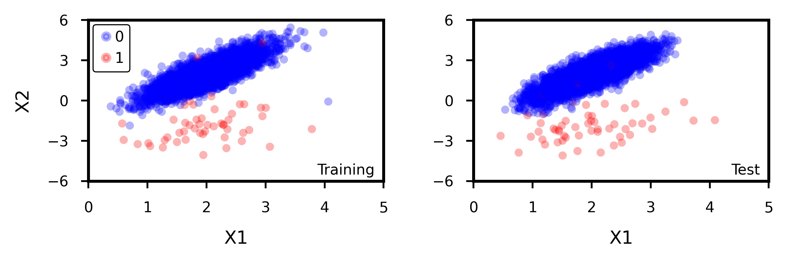
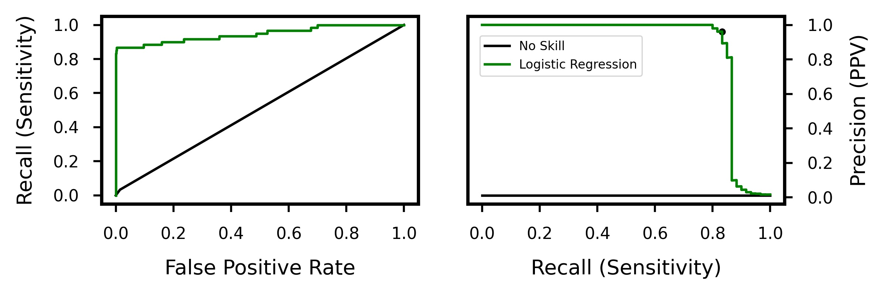
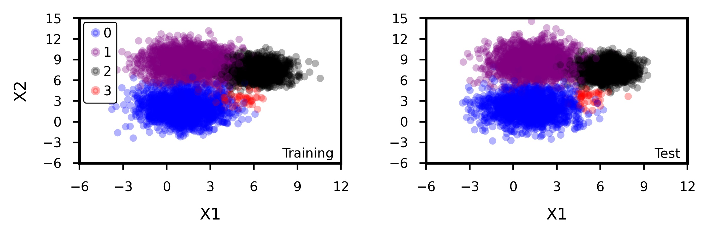
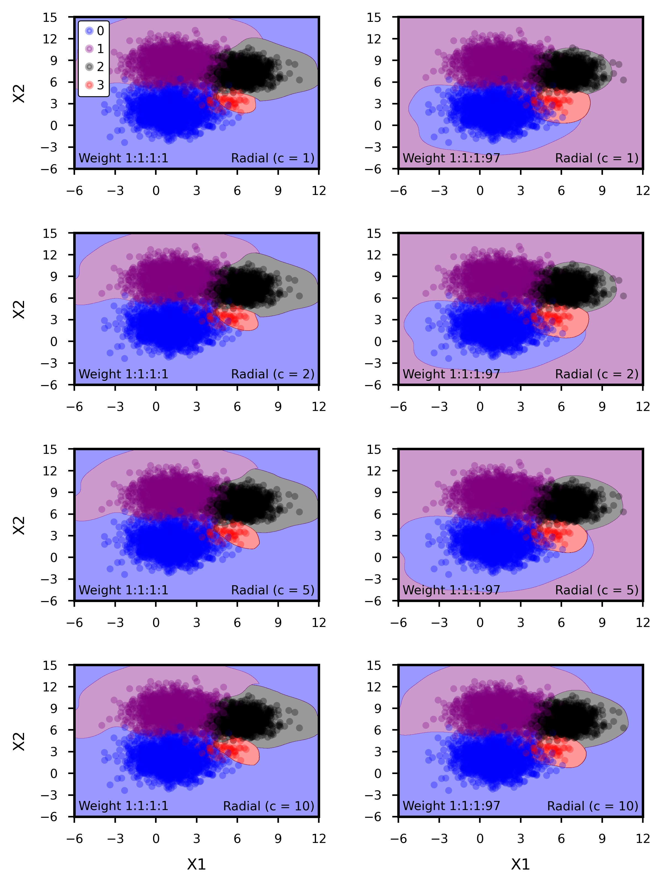

\newpage

```{r setup, include = FALSE}

knitr::opts_chunk$set(echo = TRUE, eval = FALSE)
library(reticulate)

```

# Introduction

Imbalanced data can prove to be quite challenging to work with when using conventional machine learning algorithms, as many of these algorithms operate under the assumption that all classes in the data are approximately balanced. However, in many cases, the data we are most interested in classifying are often a minority of observations in the entire set; for example, a few spam emails out of hundreds of legitimate messages, or a few fraudulent credit card transactions out of thousands of legitimate purchases. Because traditional measurements of model performance often focus on metrics such as classification accuracy, they often fail to adequately capture the minority class, and we may observe instances when a model on a dataset with 990 observations in class A and 10 observations in class B can achieve 99% accuracy by completely ignoring class B and classifying everything as A. Also, the costs of misclassification might vary between the classes; for example, while fraudulent credit card transactions are extremely rare compared to legitimate purchases, a fraudulent transaction that is not detected may cost a bank or credit card company significantly more than a legitimate transaction that is falsely flagged as fraudulent. Many algorithms by default will assume equal costs of misclassification, which may not necessarily be true for certain scenarios.

Here, we use synthetic data to explore some of the tools available in Python for classifying imbalanced data, heavily relying on `sklearn` for most of model and scoring functions but also utilising some of the various sampling functions from `imbalanced-learn`. Some of the topics we explore include scoring metrics such as area under the precision-recall curve (AUPRC), cost-sensitive learning using class weights, and various techniques to rebalance data such as SMOTE and ADASYN. We also explore imbalanced classification in datasets with binary classes as well as in datasets with three or more classes.

# Two-Class Classification

## Data Generation

First, we set up a two-class classification problem. We randomly generate a total of 10000 samples, with the majority class making up 99% of the data and the minority class making up the other 1%. We can do this using the `make_classification` function from `sklearn`.

``` {python}

data_x, data_y = make_classification(n_samples = 10000, n_classes = 2, n_features = 2,
                                     n_informative = 2, n_redundant = 0, n_repeated = 0,
                                     weights = [0.99, 0.01], n_clusters_per_class = 1,
                                     flip_y = 0.006, random_state = 1, class_sep = 2)

```

As can be seen in Figure \ref{fig:Figure1}, we allow for a bit of overlap between the two classes so that we can explore the trade-offs involved in misclassifying points in the overlap zone; this becomes especially interesting once we assign different costs to the correct classification of each class.

```{r Figure1, eval = TRUE, echo = FALSE, out.width = "450px", out.height = "450px", fig.cap = "\\label{fig:Figure1} A 50/50 split of the data into training (left) and test (right) sets. The majority class outnumbers the minority class by a ratio of 99:1. \\bigskip \\smallskip"}



```

## Discriminant Analysis

We begin our exploration of the data by fitting linear discriminant analysis (LDA) and quadratic discriminant analysis (QDA) models to our data. Before doing this, we start with a single validation set approach, splitting the data into a training set (50%) and test set (50%), done using the code below.

``` {python}

train_x, test_x, train_y, test_y = train_test_split(data_x, data_y, test_size = 0.5,
                                                    random_state = 2, stratify = data_y)

```

We can then fit the model to the training set before evaluating it on the test set. To fit the LDA and QDA models, we can use the `LinearDiscriminantAnalysis` and `QuadraticDiscriminantAnalysis` functions from `sklearn`, as is shown in the code below. For each model, we first create a model object using each its respective function and then use the `fit` method to fit the models to the training data.

``` {python}

clfLDA = LinearDiscriminantAnalysis()
clfLDA.fit(train_x, train_y)
clfQDA = QuadraticDiscriminantAnalysis()
clfQDA.fit(train_x, train_y)

```

For now, we assume that the cost of misclassifying a point from the majority class is the same as misclassifying a point from the minority class, so we do not place weights on either class. As such, we can compare performance on the training data using a micro-averaged F1-score, and find that the LDA model outperforms the QDA model at 0.9962 versus 0.9958. We can also compare performance using the area under the precision-recall curve (AUPRC) on the training data and find that LDA again outperforms QDA at 0.8429 versus 0.8207. As can be seen in Figure \ref{fig:Figure2}, these differences are likely due to the fact that the QDA model misclassifies several majority class data points near the decision boundary, while the LDA model only does so to a lesser extent. At this point, it is clear that the linear model performs better than the quadratic model, so we choose the former over the latter and then evaluate its performance on the test data; upon doing so, we get a micro-averaged F1-score of 0.9976 and an AUPRC of 0.8994, indicating that the linear model actually performs better on the test data than it does on the training data.

It is important to note that the way the data is partitioned can affect model results, especially when using a single validation set; cross-validation provides an alternative approach that is more robust to randomness in how the training and test data are split, often allowing for more accurate model fitting and selection. We can write a function that performs cross-validation on a specified model and then returns the desired metrics, as has been done below.

``` {python}

def model_cv(obj, n_rep, metList, data_x = data_x, data_y = data_y):
    cv = RepeatedStratifiedKFold(n_splits = 2, n_repeats = n_rep, random_state = 32463)
    output = cross_validate(obj, data_x, data_y, cv = cv, scoring = metList, n_jobs = -1)
    df = DataFrame(columns = ["metric", "value"])
    for i in metList:
        newdat = DataFrame({"metric":[i], "value":[mean(output["test_" + i])]})
        df = df.append(newdat, ignore_index = True)
    print(df)

```

```{r Figure2, eval = TRUE, echo = FALSE, out.width = "450px", out.height = "450px", fig.cap = "\\label{fig:Figure2} Decision boundaries generated by fitting LDA (left) and QDA (right) models to the training data. \\smallskip"}


```

Here, we supply the function with a model, the number of replicates, and a list of metrics that we would like to calculate. The function then performs a 50/50 split on the data, fits the model to the training data, then evaluates the supplied metrics on the test data. This is then done for the specified number of replicates, and then each metric is averaged over the results of all replicates. We can then use this function for LDA and QDA, getting the mean micro-averaged and weighted F1-scores over 1000 replicates of 2-fold cross validation.

``` {python}

model_cv(obj = clfLDA, n_rep = 1000, metList = ["f1_micro", "f1_weighted"])
model_cv(obj = clfQDA, n_rep = 1000, metList = ["f1_micro", "f1_weighted"])

```

We again find that LDA outperforms QDA, with a mean micro-averaged F1-score of 0.9969 versus 0.9965. Thus, for this particular exercise, the LDA model is our model of choice.

## Support Vector Machines: Cost-Insensitive

We can also use the `SVC` function to fit support vector machines to our data, using the resulting decision boundary to classify the observations. Similar to what we did with LDA and QDA, we first create model objects using SVC and then use the `fit` method to fit the models to the training data.

``` {python}

clfLin = svm.SVC(gamma = "auto", kernel = "linear")
clfLin.fit(train_x, train_y)
clf2dg = svm.SVC(gamma = "auto", kernel = "poly", degree = 2)
clf2dg.fit(train_x, train_y)
clf3dg = svm.SVC(gamma = "auto", kernel = "poly", degree = 3)
clf3dg.fit(train_x, train_y)
clfRbf = svm.SVC(gamma = "auto", kernel = "rbf")
clfRbf.fit(train_x, train_y)

```

Here, we fit four different kernels to the same training set we used earlier: a linear kernel, a 2nd-degree polynomial kernel, a 3nd-degree polynomial kernel, and a radial kernel (with default $c=1$). The results of doing so, which can be seen in the left-hand panels of Figure \ref{fig:Figure3}, show that much like LDA and QDA, the models can correctly classify almost all of the observations in majority class while only missing a few observations in the minority class.

After using the `model_cv` function we defined earlier to perform 1000 instances of 2-fold cross-validation, we find that the 2nd-degree polynomial model performs the best with a mean micro-averaged F1-score of 0.99678, and the 3rd-degree polynomial model performs the worst with a mean micro-averaged F1-score of 0.99661. Note that we still assume the cost of misclassifying a point from the majority class is the same as misclassifying a point from the minority class, so the use of micro-averaged F1-score as a scoring metric is still appropriate.

```{r Figure3, eval = TRUE, echo = FALSE, out.width = "600px", out.height = "600px", fig.cap = "\\label{fig:Figure3} Decision boundaries generated by various SVM kernels to the training data, with no weight on the minority class (left column) and a 1:99 weight favouring the minority class (right column)."}

knitr::include_graphics("Plot_SVM.jpeg")

```

## Support Vector Machines: Cost-Sensitive

In many instances, correct classification of the minority class is more important than that of the majority class, often allowing us to let some observations in the majority class be incorrectly classified in order to correctly classify more observations in the minority class. We can implement a form of cost-sensitive learning by using the `class_weight` argument in the `SVC` function, as can be seen in the linear kernel example below.

``` {python}

clfLinC = svm.SVC(gamma = "auto", kernel = "linear", class_weight = {0:0.01, 1:0.99})
clfLinC.fit(train_x, train_y)

```

Here, we specify that the classes are weighted at a 1:99 ratio, with the weight of a minority class observation 99 times as high as that of a majority class observation. Thus, there is an extreme penalty for misclassifying an observation from the minority class compared to doing so on an observation from the majority class; as such, in comparison to the unweighted kernels, we would expect the decision boundary to shift upward, "sacrificing" several majority observations to correctly classify a few additional minority observations. This is evident in the right-hand panels of Figure \ref{fig:Figure3}, where the decision boundaries now cut into the majority observations and misclassify several of them to correctly classify an additional 4 or 5 observations in the minority class. Note that the `LinearDiscriminantAnalysis` and `QuadraticDiscriminantAnalysis` functions, at the time this was written, do not support a `class_weight` argument, hence our decision to use it on SVM rather than LDA or QDA.

We can modify the four SVM models used earlier to account for a 1:99 class weight, but how can we evaluate their performance? Because our observations now have different weights depending on their class, a micro-averaged F1-score may no longer be appropriate since it gives equal importance to each observation. To avoid this issue, we can use balanced accuracy in place of micro-averaged F1-score in our `model_cv` function; this balanced accuracy, calculated using the `balanced_accuracy_score` function from `sklearn`, is the average of recall obtained on each class. This equally weights the classes by default, but we can re-write the source code for this function to allow for class-specific weights to be assigned.

``` {python}

# Redefine balanced_accuracy_score to allow for class weights
def balanced_accuracy_score2(y_true, y_pred, *, w1, w2, adjusted = False):
    C = metrics.confusion_matrix(y_true, y_pred)
    with numpy.errstate(divide = "ignore", invalid = "ignore"):
        per_class = numpy.diag(C) / C.sum(axis = 1)
    if numpy.any(numpy.isnan(per_class)):
        warnings.warn("y_pred contains classes not in y_true")
        per_class = per_class[~numpy.isnan(per_class)]
    score = per_class[0]*w1 + per_class[1]*w2
    if adjusted:
        n_classes = len(per_class)
        chance = 1 / n_classes
        score -= chance
        score /= 1 - chance
    return score

# Turn above function into scorer
scorer = make_scorer(balanced_accuracy_score2, w1 = 1/100, w2 = 99/100)

```

Here, we use `w1` and `w2` to assign class-specific weights, and have weighted the majority and minority classes at a 1:99 ratio; as such, the resulting score will be heavily biased towards models that can correctly classify the minority class. At this point, our metric is not so much a "balanced accuracy" but more of a "weighted accuracy" since the class weights in our new scoring metric are not 50/50, so we will refer to it as such. We then define a new alternative to `model_cv`, `model_cv_bal`, that performs the same cross-validation as `model_cv` but accepts our custom scorer we just defined.

``` {python}

def model_cv_bal(obj, n_repeats, data_x = data_x, data_y = data_y):
    cv = RepeatedStratifiedKFold(n_splits = 2, n_repeats = n_repeats, random_state = 32463)
    output = cross_validate(obj, data_x, data_y, cv = cv, scoring = scorer, n_jobs = -1)
    print(mean(output["test_score"]))

```

After using the `model_cv_bal` function to perform 1000 instances of 2-fold cross-validation, we find that the radial model performs the best with a mean weighted accuracy of 0.82913, and the 3rd-degree polynomial model performs the worst with a mean weighted accuracy of 0.82179.

## Precision-Recall Curves

Typically, when working with balanced data sets, we can plot a receiver-operator characteristic (ROC) curve and use the area under the curve (AUC) as a metric for model skill, allowing us to compare predictive performance between models. However, ROC curves can be misleading on imbalanced data like ours because, much like accuracy, they will be biased towards the majority class. However, we can use precision-recall (PR) curves to avoid this issue, focusing on the trade-off between precision and recall rather than that between recall and false positive rate.

Because we will eventually work with predicted probabilities when plotting these curves, and SVM does not return probabilities after fitting the models, we will use a logistic regression for this example. We use the `LogisticRegression` function from `sklearn` to fit a logistic regression, and then use the `predict_proba` method to get predicted probabilities. For this example, we assume equal weights between the two classes; however, given that `LogisticRegression` supports a `class_weight` argument, we could weight the classes like we did in the previous example if we wish.

``` {python}

clfLrg = LogisticRegression(solver = "lbfgs")
clfLrg.fit(train_x, train_y)
y_hat = clfLrg.predict_proba(test_x)
p_model = y_hat[:, 1]

```

Now that we have a vector of predicted probabilities, we can use these probabilities and the actual class labels to calculate AUC for the ROC and PR curves. The `roc_auc_score` function will directly return an AUC for an ROC curve when given class labels and predicted probabilities; for the PR curve, we can use the `precision_recall_curve` function to calculate the values of precision and recall along the curve, and then use these values in the `auc` function to get the area under the precision-recall curve (AUPRC).

``` {python}

# Calculate AUC
print(roc_auc_score(test_y, p_model))

# Calculate AUPRC
precision, recall, _ = precision_recall_curve(test_y, p_model)
print(auc(recall, precision))

```

In doing so, we get an AUC of 0.9459 and an AUPRC of 0.8660. The ROC and precision-recall curves are shown in Figure \ref{fig:Figure4}; as can be seen here, the ROC curve exhibits extremely high skill, which is largely driven by correct classification of the majority class due to the massive class imbalance. From the precision-recall curve, we also see high skill and a steep drop in precision when recall approaches 1, indicating strong separation between the two classes.

```{r Figure4, eval = TRUE, echo = FALSE, out.width = "470px", out.height = "470px", fig.cap = "\\label{fig:Figure4} ROC curve (left) and precision-recall curve (right) for a logistic regression fit when using an unweighted logistic regression on a single validation set. The black lines represent the no-skill model, while the green lines represent the logistic regression; the black point on the precision-recall curve is the location at which the F1-score (i.e. the harmonic mean of precision and recall) is maximised. \\bigskip"}



```

Note that by default, the probability threshold for classifying each observation is 0.5; if the predicted probability of belonging to a given class is 0.5 or greater, then an observation is assigned to that class, else it is assigned to the other class. However, this threshold of 0.5 may not be optimal, and there may be a higher or lower threshold that actually improves model performance. As such, we can tune our probability threshold to find a value that maximises some measure of model skill; for this example, we choose to maximise the F1-score. The results for finding model precision, recall, and F1-score for a range of probability thresholds are given in Figure \ref{fig:Figure5}; here, we see that the maximum F1-score of 0.893 occurs at a probability threshold of approximately 0.166. This F1-score offers a slight improvement over the F1-score of 0.868 that occurs when using the default probability threshold, indicating that properly tuning the probability cutoff for classification can improve model performance.

## Rebalancing With Over- and Under-Sampling

Sometimes, it may be necessary to reduce the imbalance between classes in order to increase model performance or ensure that data are compatible with a specific model type. Two possible techniques to accomplish this are random oversampling and undersampling, both of which are used to rebalance the training data before fitting any models. Oversampling increases the number of observations in the minority class by randomly replicating minority class observations, while undersampling decreases the number of observations in the majority class by randomly removing majority class observations. While both methods create more balanced data and can allow for better model fits, each one has its own disadvantages too: oversampling can increase data size (and thus require more computational resources for model fitting) and has the possibility to overfit, while undersampling can remove observations that are particularly important in constructing a decision boundary since observations are removed at random without any consideration regarding potential model impacts. It should be noted that random oversampling and undersampling are only two of the various ways to rebalance class data; some sampling methods perform non-random sampling or interpolate new data points between existing ones, the latter of which we will explore later when examining SMOTE and ADASYN.

Before performing oversampling or undersampling, we first establish a baseline level of performance by evaluating a model that utilises neither of these two rebalancing methods. Here, we fit a logistic regression with a 99:1 weight on the minority class, thus prioritising the correct classification of observations in the minority.

``` {python}

clfLrgC = LogisticRegression(solver = "lbfgs", class_weight = {0:0.01, 1:0.99})
model_cv_bal(clfLrgC, 1000)

```

1000 replicates of 2-fold cross-validation results in a weighted accuracy of 0.8415, which is slightly higher than any of the weighted SVM models from our earlier analyses.

```{r Figure5, eval = TRUE, echo = FALSE, out.width = "470px", out.height = "470px", fig.cap = "\\label{fig:Figure5} Precision and recall (left) and F1-score (right) across the range of possible probability thresholds when using an unweighted logistic regression on a single validation set. \\bigskip"}

knitr::include_graphics("Plot_Prt.jpeg")

```

We now rebalance the training data using oversampling. Because our `model_cv_bal` function also accepts pipelines as an argument, we can use the `Pipeline` function from `imbalanced-learn` to condense any data transformations and model fits into a single object for the sake of convenience. For example, we can define a pipeline that performs random oversampling on the training data before fitting a logistic regression to it, and then feed this particular pipeline to the `obj` argument in `model_cv_bal`. As can be seen below, for each replicate in the cross-validation, the data will be split 50/50 into training and test sets, the training set will be oversampled, a logistic regression will be fit to the training set, and then model performance will be evaluated on the test set.

``` {python}

pipeline = Pipeline([("samp", RandomOverSampler(sampling_strategy = "minority")),
                     ("model", LogisticRegression(solver = "lbfgs",
                                                  class_weight = {0:0.01, 1:0.99}))])
model_cv_bal(pipeline, 1000)

```

For the oversampling function `RandomOverSampler`, the `sampling_strategy` argument determines how the minority class will be oversampled relative to the majority class. Setting this argument to `minority` oversamples the minority class at a 1:1 ratio with the majority class; thus, if the training set has 3900 majority class observations and 100 minority class observations, it will now have 3900 observations of each class after oversampling. After employing this oversampling in our cross-validation, we get a weighted accuracy of 0.9892, which is significantly higher than that resulting from the original sampling strategy.

Next, we undersample the data using a nearly identical pipeline setup, with the only differences being the use of  `RandomUnderSampler` in place of `RandomOverSampler` and a new value for the `sampling_strategy` argument.

``` {python}

pipeline = Pipeline([("samp", RandomUnderSampler(sampling_strategy = "majority")),
                     ("model", LogisticRegression(solver = "lbfgs",
                                                  class_weight = {0:0.01, 1:0.99}))])
model_cv_bal(pipeline, 1000)

```

Here, the `sampling_strategy` argument determines how the majority class will be undersampled. Setting this argument to `majority` undersamples the majority class at a 1:1 ratio with the minority class; thus, if the training set has 3900 majority class observations and 100 minority class observations, it will now have 100 observations of each class after undersampling. After employing this undersampling in our cross-validation, we now get a weighted accuracy of 0.9899 which is significantly higher than that resulting from the original sampling strategy, and slightly higher than that resulting from oversampling.

We can also combine oversampling and undersampling to fine-tune the ratio of observations in the majority and minority classes, as can be seen below.

``` {python}

pipeline = Pipeline([("samp1", RandomOverSampler(sampling_strategy = 0.25)),
                     ("samp2", RandomUnderSampler(sampling_strategy = 0.5)),
                     ("model", LogisticRegression(solver = "lbfgs",
                                                  class_weight = {0:0.01, 1:0.99}))])
model_cv_bal(pipeline, 1000)

```

Here, we set `sampling_strategy` equal to 0.25 so that there is a 4:1 majority/minority class ratio after oversampling, and then set `sampling_strategy` to 0.5 so that there is a 2:1 majority/minority class ratio after undersampling. Thus, if the training set has 3900 majority class observations and 100 minority class observations, it will have 3900 majority class observations and 975 minority class observations after oversampling, and will then have 1950 majority class observations and 975 minority class observations after undersampling. After employing this sequence of oversampling and undersampling in our cross-validation, we get a weighted accuracy of 0.9879, which is only slightly lower than that resulting from just oversampling or undersampling.

# Multi-Class Classificaton

## Data Generation

With some minor adjustments, we can adapt our code for generating synthetic two-class data to include three or more classes. Here, we randomly generate a total of 10000 samples from four classes, with three classes making up 99% of the data and the minority class making up the other 1%. We can do this using the `make_blobs` function from `sklearn`, which generates isotropic Gaussian distributions of data in a given number of dimensions.

``` {python}

data_x, data_y = make_blobs(n_samples = [3500, 3500, 3400, 100], n_features = 2,
                            cluster_std = [1.5, 1.5, 1, 0.8], random_state = 1,
                            centers = numpy.array([[1.1, 2.0], [1.5, 8.5],
                                                   [6.4, 7.4], [5.2, 3.5]]))

```

As can be seen in Figure \ref{fig:Figure6}, we again allow for a bit of overlap between the minority class and the other classes so that we can explore the trade-offs involved in misclassifying points in the overlap zone.

```{r Figure6, eval = TRUE, echo = FALSE, out.width = "450px", out.height = "450px", fig.cap = "\\label{fig:Figure6} A 50/50 split of the data into training (left) and test (right) sets. The blue, purple, black, and red classes are (respectively) generated at a 35:35:34:1 ratio. \\bigskip \\smallskip"}



```

## Support Vector Machines: Cost-Insensitive

Much like we did with the binary data in our previous analyses, we can also fit SVMs to multi-class data. However, a quick look at Figure \ref{fig:Figure6} shows that unlike earlier, linear and polynomial kernels will fail to adequately separate the four classes because there is no single line that could partition our coordinate space into four separate areas. As such, a radial kernel will be necessary, and we can examine how varying the cost parameter $C$ changes model performance.

``` {python}

clfRC1 = svm.SVC(gamma = "auto", kernel = "rbf", C = 1)
clfRC1.fit(train_x, train_y)
clfRC2 = svm.SVC(gamma = "auto", kernel = "rbf", C = 2)
clfRC2.fit(train_x, train_y)

```

Note that just like in our cost-insensitive models for the binary data, we assume that the cost of misclassifying a point from the majority class is the same as misclassifying a point from the minority class. The results of doing so, which can be seen in the left-hand column of Figure \ref{fig:Figure7}, show that the four different kernels do a decent job of correctly classifying observations in most of the coordinate space, but unsurprisingly struggle in the overlap zones. Interestingly, it seems that the decision boundaries do not change much when increasing the value of $C$. We also notice that the areas enclosed by radial decision boundaries are finite for three of the four classes and infinite for the other, which happens to be the blue class in all of these cost-insensitive models.

After using the `model_cv` function we defined earlier to perform 1000 instances of 2-fold cross-validation, we find that the kernel with $C=1$ performs the best with a mean micro-averaged F1-score of 0.99676, and the kernel with $C=5$ performs the worst with a mean micro-averaged F1-score of 0.99675; because the differences between the four kernels are so miniscule, for all intents and purposes, they perform approximately the same, and varying the cost parameter $C$ between 1 and 10 makes virtually no difference.

```{r Figure7, eval = TRUE, echo = FALSE, out.width = "600px", out.height = "600px", fig.cap = "\\label{fig:Figure7} Decision boundaries generated by various SVM kernels to the training data, with no weight on the minority class (left column) and a 1:1:1:97 weight favouring the minority class (right column)."}



```

## Support Vector Machines: Cost-Sensitive

Much like in the binary data from our earlier analyses, we can use the `class_weight` argument in the `SVC` function to accommodate class weights for more than two classes, as can be seen in the $C=1$ radial kernel example below.

``` {python}

clfRC1C = svm.SVC(gamma = "auto", kernel = "rbf", C = 1,
                  class_weight = {0:0.01, 1:0.01, 2:0.01, 3:0.97})
clfRC1C.fit(train_x, train_y)

```

Here, we specify that the classes are weighted at a 1:1:1:97 ratio, with the weight of a minority class observation 97 times as high as that of an observation from any of the three larger classes; as such, there is again an extreme penalty for misclassifying any observations from the minority class. The results of fitting these weighted models using only a single training and test set yields are shown in the right-hand column of Figure \ref{fig:Figure7}, where the decision area for the red minority class is larger, and leads to the misclassification of more observations from the black and blue classes to accommodate the shift in weights. Thus, similar to adding weights to our binary classification from earlier, we "sacrifice" several majority observations to correctly classify a few additional minority observations.

Again, because our observations now have different weights depending on their class, a micro-averaged F1-score may no longer be appropriate since it gives equal importance to each observation. To solve this problem, we can re-write our `balanced_accuracy_score2` function to support class-specific weights for more than two classes. This adjustment is simple and only involves changing a small amount of code for the `balanced_accuracy_score2` and `make_scorer` functions.

``` {python}

# Redefine balanced_accuracy_score2 to allow for class weights
# Ellipsis indicates code from balanced_accuracy_score2 that was not modified
def balanced_accuracy_score3(y_true, y_pred, *, w1, w2, w3, w4, adjusted = False):
    ...
    score = per_class[0]*w1 + per_class[1]*w2 + per_class[2]*w3 + per_class[3]*w4
    ...

# Turn above function into scorer
scorer = make_scorer(balanced_accuracy_score2, w1 = 1/100, w2 = 1/100,
                     w3 = 1/100, w4 = 97/100)

```

After using the new scorer in `model_cv_bal`, we find that the kernel with $C=1$ performs the best with a mean weighted accuracy of 0.98982, and the kernel with $C=10$ performs the worst with a mean weighted accuracy of 0.95871.

## Rebalancing With SMOTE and ADASYN
